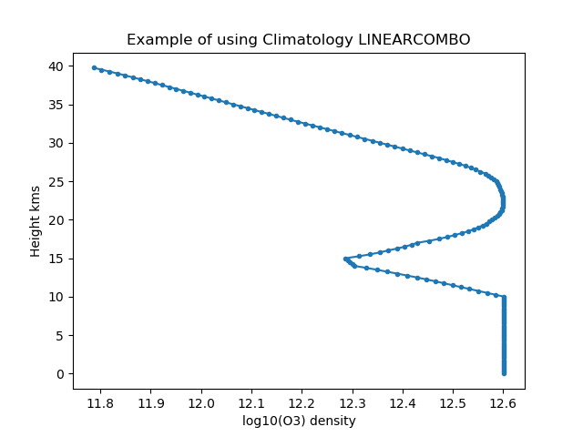

.. _clim_linearcombo:

LINEARCOMBO
===========
A climatology that generates height profiles using a height dependent, linear combination of two climatologies. This is useful if one
wishes to use one climatology in one height range and another climatology in another height range with a sensible transition region in between.
If we let the first climatology generate value :math:`v_1(h)` at a given height and the second climatology generate value :math:`v_2(h)` at the same height then the
LINEARCOMBO climatology will generate a value :math:`v(h)` given by,

.. math::
        v = f(h)v_{1}(h) + (1-f(h))v_{2}(h)

where :math:`f(h)` is a height dependent function with a value ranging between 0 and 1.  The user provides the height profile,
:math:`f(h)`, as a linear piecewise function, :math:`f_{i}(h_i)`, consisting of :math:`N` segments that span the height range of
interest and,

.. math::

        f(h) =  f_{i} + \frac{ f_{i+1} - f_{i} }{h_{i+1}-h_i}(h-h_i)

:math:`f(h)` is the factor applied to the first climatology and :math:`1-f(h)` is applied to the
second climatology. Values of :math:`f(h)` above or below the height range of the piecewise function are truncated to the appropriate end value. ::

    import numpy as np
    import matplotlib.pyplot as plt
    import sasktranif as skif

    mjd      = 52393.3792987115
    labow    = skif.ISKClimatology('O3LABOW')                                # The first climatology will be LABOW ozone
    constant = skif.ISKClimatology('CONSTANTVALUE')                          # The second climatology witll be a constant value
    constant.SetProperty('SetConstantValue', 4.0E12)                        # set the constant value  to a fixed number

    climate = skif.ISKClimatology('LINEARCOMBO')                             # generate the linear combo cliamtology
    climate.SetProperty('SetFirstClimatology',  labow)                       # set labow as the first claimatology
    climate.SetProperty('SetSecondClimatology', constant)                    # set the the constant as the second climatology
    f = [ 10000.0, 0.0, 15000.0, 1.0]                                        # Create the height profile of the linear combination
    climate.SetProperty('SetHeightProfileCoeffsOfFirstClimatology', f )      # constant value below 10000, labow above 15000, linear in between

    h = np.arange(0.0, 40000.0, 250.0)
    ok,profile = climate.GetHeightProfile('SKCLIMATOLOGY_O3_CM3', [52.0, -106, 0.0, mjd], h)
    plt.figure(1)
    plt.plot( np.log10( profile), h/1000.0,  '.-')
    plt.xlabel( 'log10(O3) density' )
    plt.ylabel('Height kms')
    plt.title('Example of using Climatology LINEARCOMBO')
    plt.show()
    print('Done')

Supported Species
-----------------
Only supports the species supported by both of the internal climatologies.

Cache Snapshot
--------------
The LINEARCOMBO climatology has no internal cache of its own. It uses the internal caches of the two compoent climatologies

Properties
----------
.. py:function:: SetFirstClimatology( skClimatology climate)

    Sets the first of the two climatologies used in the linear combination. The object passed in must represent an skClimatology object.
    :meth:`ISKClimatology.SetPropertyObject`

.. option:: SetSecondClimatology( skClimatology climate )

    Sets the second of the two climatologies used in the linear combination. The object passed in must represent an skClimatology object.
    :meth:`ISKClimatology.SetPropertyObject`

.. option:: SetHeightProfileCoeffsOfFirstClimatology( Array linearpiecewise_profile )

    Sets the piecewise linear height profile, :math:`f_i(h_i)` of :math:`f`. The values of :math:`h_i` and :math:`f_i` are
    passed in as a single 1-D array where the order in memory is ... :math:`h_i, f_i, h_{i+1}, f_{i+1}`... . I.E. An array of height
    followed by value. The :math:`h_i` are expressed as height in meters above sea level and must be in ascending order. The  :math:`f_i`
    are numbers between 0 and 1. The array passed in will be twice as big as the number of coefficients.
    :meth:`ISKClimatology.SetPropertyVector`

