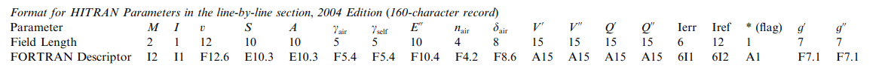
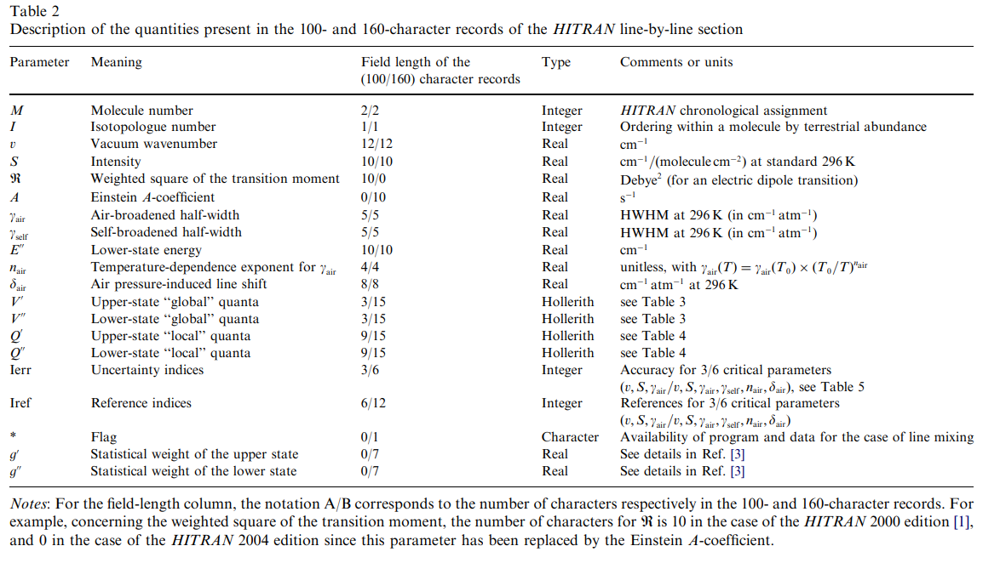

.. _emissions_hitran_photochemical:

HITRAN_PHOTOCHEMICAL
====================
An emission class that calculates photo-chemical emissions from the excited states of molecules using the Einstein-A
coefficients given in the Hitran database. Note the class does not calculate the photo-chemistry of the atmosphere and the
the user must provide climatologies that calculate the number of excited upper states in the molecule of interest.

Usage
^^^^^
It is recommended that an object only be used for photo-chemical calculations using one configuration
(i.e. molecule, wavelengths, isotopes, band selection). New configurations should use new objects rather than re-use
an existing object.

It is recommended that some filtering be applied to the spectral lines otherwise calculations may be very slow as all lines
that pass through the filters are used to calculate the emission at any wavelength regardless of distance of the line from the
wavelength.

Spectral lines selection can be filtered with a combination of strategies,

   * wavelength or wavenumber range
   * lower state global quanta
   * upper state global quanta
   * isotopes

The code has been written to model mesospheric photo-chemical emissions from molecular oxygen and similar and several of
the features reflect this purpose. The code implicitly assumes the user is trying to look at the emission from a
molecular vibrational band and it must estimate the population and occupancy of each upper state.  To do this, the code
takes all the unfiltered spectral lines and calculates the number of unique upper states. It then thermalizes the
population of electrons across all the upper states using a Boltzmann distribution.  It is important that users
restrict the filtered lines to just the lines associated with the vibrational band of interest.

Sasktran Support
^^^^^^^^^^^^^^^^
This object is available via a simpler interface from `sasktran` as class `sasktran.HITRANPhotoChemical` and
is also used in classes `sasktran.HITRANPhotoChemical_O2_ABand` and `sasktran.HITRANPhotoChemical_O2_SingletDelta`.

Properties
----------
..  module:: HITRAN_PHOTOCHEMICAL

All properties are associated with initialization activity and are typically performed immediately after object creation and before the
first call to `IsotropicRadiance`

.. py:function:: set_chemical_name( string name)

   Sets the name of the molecule being considered. This is the name used by the Hitran database and is usually the same as the
   chemical formula, eg O2.

.. py:function:: set_wavenumber_range( array v)

   A two element array that specifies the range of wavenumbers in cm-1 used to select spectral lines from the Hitran
   database. The first element is the lower wavenumber and the second element is the upper wavenumber. Do **NOT** use wavelengths.

.. py:function:: enable_cached_emissions( array wavenumbers)

   An optimization for engines such as `HR` which do not support calls to calculate emissions for multiple wavelengths in one go.
   such as `HR`. The property must pass in a 1-D array that contains the wavenumbers at which emissions will be required by the engine.
   This option will force the emissions object to calculate and store emissions for all the given wavenumbers at all locations
   in the atmosphere (ie when UpdateLocation() is called).

.. py:function:: setisotopefilter (int isotopeid)

    Sets the filter used to either select all isotopes of the target molecule from the Hitran database or pick just one. A value
    of 0 will select all isotopes. A value of 1 selects the isotope for the target molecule labelled as 1 in the Hitran database.
    Similar for 2,3, ... and so on. The isotope labelled as 1 is usually the dominant isotope in the atmosphere, 2 the second dominant
    3 the third etc. Default is 0.

.. py:function:: set_lower_state_global_quanta_filter( str quanta_filter)

    Sets the filter to either select all spectral lines in the given wavenumber range or pick the ones that match the
    lower state quantum filter. These quanta are given in the Hitran data records as the :math:`V'` and :math:`V''` fields
    and are strings similar to "X 0". The code will only accept spectral lines that match the lower state filter. The code ignores
    spaces but is case sensitive and order sensitive. i.e 'X 0' is not the same as '0 X'.  This option requires the user to be familiar
    with the Hitran 160 character records and is comfortable reading the Hitran files to ascertain the notation used in the database files.
    An empty string disables the filter and matches all spectral lines. Default is the empty string, "".

.. py:function:: set_upper_state_global_quanta_filter( str quanta_filter )

    Same as `set_lower_global_quanta_filter` except for the upepr state. The default is the empty string, "".

.. py:function:: set_self_broadening_climatology( object climatology)

    Optional. Sets the :ref:`climatology <climatologies>` that will be used for self-broadening calculations. The climatology must provide the
    the number density of the target molecule in molecules/cm3, also see `set_self_broadening_climatology_handle`. This
    value is used along with the pressure and temperature values from the `atmospheric_state_climatology` to calculate
    the partial pressure of the molecule which is used in the self broadening calculation. If not set then a value of
    0.0 is used and self broadening is ignored. For reference, ignoring this item leads to an error on the order of 1%
    for O2 in the A-band.

.. py:function::	set_self_broadening_climatology_handle( str handle)

    Optional. This sets the :ref:`climatology handle <climatologyhandles>` used by the self-broadening climatology to acquire the number of
    molecules per cm3 of the target molecule. It must be set if the self-broadening climatology is set. A typical value
    for the oxygen molecule is 'SKCLIMATOLOGY_O2_CM3'.

.. py:function::	set_excited_upper_state_climatology( object climatology )

    Sets the :ref:`climatology <climatologies>` used to calculate the total number of excited upper state molecules in
    molecules/cm3. This climatology captures the photo-chemistry of the atmosphere and can be as simple as a user defined
    height profile or a more complicted photo-chemical model. It is important to ensure that number of excited molecules is consistent
    with the selected spectral lines, i.e. they are referring to the same vibrational band etc. The climatology will retrieve
    the value set by property `set_excited_upper_state_climatology_handle`.

.. py:function:: set_excited_upper_state_climatology_handle( str handle )

    Sets the :ref:`climatology handle <climatologyhandles>` used by the excited upper-state climatology to acquire the number of
    excited molecules per cm3. It must be set if the excited upper-state climatology is set. A typical value
    for the oxygen molecule is 'SKEMISSION_PHOTOCHEMICAL_O2'.

.. py:function::	set_atmospheric_state_climatology( object climatology )

    Sets the :ref:`climatology <climatologies>` used to calculate the atmospheric state( pressure and temperature).

Theoretical Overview
^^^^^^^^^^^^^^^^^^^^
We consider the volume emission rate far given transition from an upper state to a lower state to be given by the Einstein A coefficient
of spontaneous emission

.. math::

      VER = n' A_{u\rightarrow l}

where :math:`n'` is the population of the upper state and :math:`A_{u\rightarrow l}` is the Einstein A coefficient. Induced emission from
Einstein B is ignored. Note we are using the Hitran system of identifying upper states with a single prime, ',  and lower states with a double prime, ''.

If we assume that the photo-chemical excitation of a given electronic and vibrational band results in thermalized distribution of states then
the occupancy, :math:`n'`, of a given excited upper state level is given by:

.. math::

   n' = g' N' \frac{\exp({-\frac{hcE'}{kT}})}{Z'(T)}

where

   * :math:`E'` is the energy of the specific upper state in the excited vibrational band.
   * :math:`g'` is the degeneracy of the upper state in the excited vibrational band.
   * :math:`N'` is the total occupancy of the excited vibrational band
   * :math:`Z`(T)` s the total partition function for the excited vibrational band

The total partition function for the excited vibrational band is given by,

.. math::

   Z'(T) = \sum_{all{\ }upper{\ }states} g' \exp({-\frac{hcE'}{kT}})

Notes:

   * Einstein A coefficients in the Hitran database are not modified for isotopic abundance. For a given isotope and transition they are roughly the same value for different isotopes.
     The signals from each isotope are modified by the Sasktran Hitran Emissions object for the isotopic abundance as given in the Hitran database.
   * The energy of an upper state is inferred from the energy of the lower state, which is given in each HITRAN record, and the wavenumber of the transition.
   * Upper states for a given isotope are considered to be identical if they are within 0.0005 cm-1 of each other ( see member `m_deltaE in class `HitranLine_SelectUpperStatesFromLines`) and have the same degeneracy
   * The degeneracy of the upper state is taken from the `statistical weight of the upper state` given in each Hitran record.
   * Sasktran Emission objects return radiance per steradian rather than photons integrated over the whole sphere. The Sasktran Hitran Emissions object divides the signals by :math:`4\pi`.
   * Sasktran Emission objects return photons per nm rather than the photons per wavenumber which are calculated by Hitran and the Voigt profiles. The Sasktran Hitran Emissions object converts the signal
     to *per nm* by multiplying by :math:`\frac{\nu^2}{10^7}`.

Hitran Fields
^^^^^^^^^^^^^
The Hitran database has been distributed as a text file of 160 character text lines since 2004. A description of these fields
is given in the `HITRAN 2004 <https://hitran.org/media/refs/HITRAN-2004.pdf>`_ paper. We have copied the description of the fields below.
We note that the exact format of the upper and low Quanta fields was slightly modified in `Hitran 2008 <https://hitran.org/media/refs/HITRAN-2008.pdf>`_, see section 4.1.1. and Table 9.

