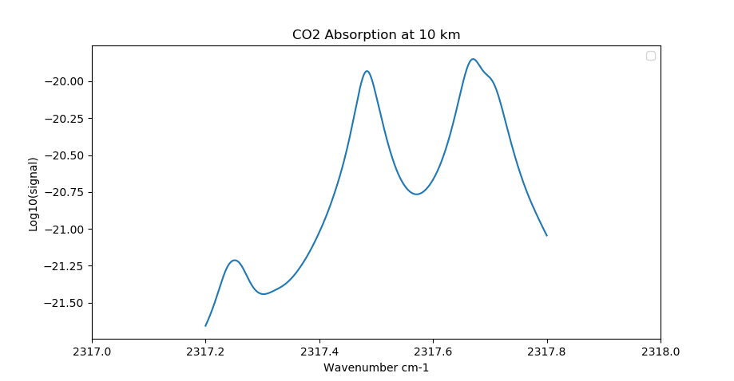
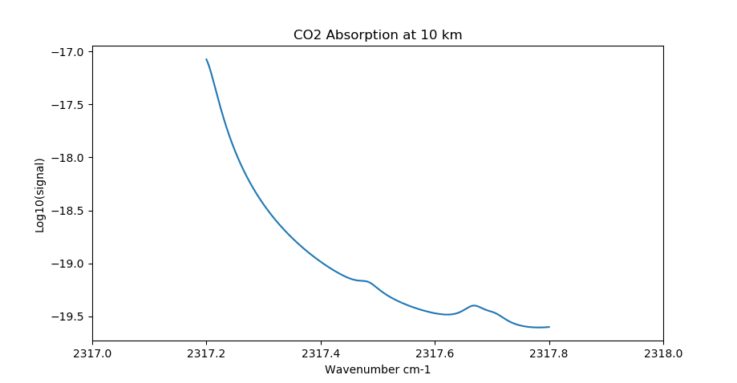
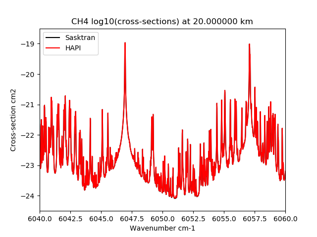

.. _optical_hitranchemical:

HITRAN Molecules
================

Calculates the optical absorption and extinction of various atmospheric molecules using the Voigt line-shape and the HITRAN spectral line database.
The object supports all of the HITRAN species specified in the HITRAN database. The current version uses the database files downloaded by the
`Hitran HAPI <https://hitran.org/hapi/>`_  interface. Automatic download support for the HAPI interface is built into the Sasktran Python implementation.
The general notation is to replace the *XXX* in* HITRANCHEMICAL_XXX* with the uppercase chemical name (e.g. H2O) to produce HITRANCHEMICAL_H2O. The exception
to the rule is the NO+ molecule (hitran index 36) which is specified as HITRANCHEMICAL_NOPLUS.

==================================  ================================ ====================== ===================
 SasktranIF Name                       Molecule                      Notes                  Molecule Number
==================================  ================================ ====================== ===================
HITRANCHEMICAL_H2O                     H\ :sub:`2`\ O                Water                   1
HITRANCHEMICAL_CO2                     CO\ :sub:`2`                  Carbon Dioxide          2
HITRANCHEMICAL_O3                      O\ :sub:`3`                   Ozone                   3
HITRANCHEMICAL_N2O                     N\ :sub:`2`\ O                Nitrogen oxide          4
HITRANCHEMICAL_CO                      CO                            Carbon Monoxide         5
HITRANCHEMICAL_CH4                     CH\ :sub:`4`                  Methane                 6
HITRANCHEMICAL_O2                      O\ :sub:`2`                   Oxygen                  7
HITRANCHEMICAL_NO                      NO                            Nitric Oxide            8
HITRANCHEMICAL_SO2                     SO\ :sub:`2`                  Sulfur Dioxide          9
HITRANCHEMICAL_NO2                     NO\ :sub:`2`                  Nitrogen Dioxide       10
HITRANCHEMICAL_NH3                     NH\ :sub:`3`                  Ammonia                11
HITRANCHEMICAL_HNO3                    HNO\ :sub:`3`                 Nitric Acid            12
HITRANCHEMICAL_OH                      OH                            Hydroxyl               13
HITRANCHEMICAL_HF                      HF                            Hydrogen Fluoride      14
HITRANCHEMICAL_HCL                     HCl                           Hydrogen Chloride      15
HITRANCHEMICAL_HBR                     HBr                           Hydrogen Bromide       16
HITRANCHEMICAL_HI                      HI                            Hydrogen Iodide        17
HITRANCHEMICAL_CLO                     ClO                           Chlorine Monoxide      18
HITRANCHEMICAL_OCS                     OCS                           Carbonyl Sulfide       19
HITRANCHEMICAL_H2CO                    H\ :sub:`2`\ CO               Formaldehyde           20
HITRANCHEMICAL_HOCL                    HOCl                          Hypochlorous Acid      21
HITRANCHEMICAL_N2                      N\ :sub:`2`                   Nitrogen               22
HITRANCHEMICAL_HCN                     HCN                           Hydrogen Cyanide       23
HITRANCHEMICAL_CH3CL                   CH\ :sub:`3`\ Cl              Methyl Chloride        24
HITRANCHEMICAL_H2O2                    H\ :sub:`2`\ O\ :sub:`2`      Hydrogen Peroxide      25
HITRANCHEMICAL_C2H2                    C\ :sub:`2`\ H\ :sub:`2`      Acetylene              26
HITRANCHEMICAL_C2H6                    C\ :sub:`2`\ H\ :sub:`6`      Ethane                 27
HITRANCHEMICAL_PH3                     PH\ :sub:`3`                  Phosphine              28
HITRANCHEMICAL_COF2                    COF\ :sub:`2`                 Carbonyl Fluoride      29
HITRANCHEMICAL_SF6                     SF\ :sub:`6`                  Sulfur Hexafluoride    30
HITRANCHEMICAL_H2S                     H\ :sub:`2`\ S                Hydrogen Sulfide       31
HITRANCHEMICAL_HCOOH                   HCOOH                         Formic Acid            32
HITRANCHEMICAL_HO2                     HO\ :sub:`2`                  Hydroperoxyl           33
HITRANCHEMICAL_O                       O                             Oxygen Atom            34
HITRANCHEMICAL_CLONO2                  ClONO\ :sub:`2`\              Chlorine Nitrate       35
HITRANCHEMICAL_NOPLUS                  NO\ :sup:`+`\                 Nitric Oxide Cation    36
HITRANCHEMICAL_HOBR                    HOBr                          Hypobromous Acid       37
HITRANCHEMICAL_C2H4                    C\ :sub:`2`\ H\ :sub:`4`      Ethylene               38
HITRANCHEMICAL_CH3OH                   CH\ :sub:`3`\ OH              Methanol               39
HITRANCHEMICAL_CH3BR                   CH\ :sub:`3`\ Br              Methyl Bromide         40
HITRANCHEMICAL_CH3CN                   CH\ :sub:`3`\ CN              Acetonitrile           41
HITRANCHEMICAL_CF4                     CF\ :sub:`4`\                 CFC-14                 42
HITRANCHEMICAL_C4H2                    C\ :sub:`4`\ H\ :sub:`2`      Diacetylene            43
HITRANCHEMICAL_HC3N                    HC\ :sub:`3`\ N               Cyanoacetylene         44
HITRANCHEMICAL_H2                      H\ :sub:`2`\                  Hydrogen               45
HITRANCHEMICAL_CS                      CS                            Carbon Monosulfide     46
HITRANCHEMICAL_SO3                     SO\ :sub:`3`\                 Sulfur trioxide        47
HITRANCHEMICAL_C2N2                    C\ :sub:`2`\ N\ :sub:`2`      Cyanogen               48
HITRANCHEMICAL_COCl2                   COCl\ :sub:`2`\               Phosgene               49
==================================  ================================ ====================== ===================

Example using the Sasktran Python interface::

    import numpy as np
    import matplotlib.pyplot as plt
    import sasktran as sk

    wavenum = np.arange( 5900.0, 6200.0, 0.001)
    wavelen = 1.0E7/wavenum
    atmos   = sk.MSIS90()
    heights =  5000
    hitran  = sk.HITRANChemical('CH4', line_tolerance=1.0E-09)
    hitran._iskopticalproperty.SetProperty('setwavenumberrange',  [5900.0, 6200.0] )
    hitran._iskopticalproperty.SetProperty('enablecachedcrosssections', wavenum)
    xs     = hitran.calculate_cross_sections(atmos, latitude=52.1315, longitude=-106.6335, altitude=heights, mjd=58290.75000000, wavelengths=wavelen)

    plt.plot( wavenum, np.log10(skfullxs.absorption), 'k-' )
    plt.title('CH4 log10(cross-sections) at {:f} km'.format(heights/1000.0))
    plt.xlabel('Wavenumber cm-1')
    plt.ylabel('Log10(Cross-sections) cm2')
    plt.show()

Micro-Windows
-------------

The HITRAN CHEMICAL class works on the concept of a micro-window and adjusts its Voigt line-shape calculations so that
distant weak lines within the micro-window are ignored once they are below a threshold criterion. This generates a
significant computational saving when used properly but can generate choppy signals when set too aggressively.
The micro-window is specified using property :py:func:`~HitranChemical.SetWavenumberRange`. By default the micro-window
is set from the first call to CalculateCrossSections; the micro window is set from the min and max values of wavenumber. If only
one value is passed (as a scalar) it subtracts and adds 10 cm-1 to make a window 20 wavenumbers wide.  This default is
reasonable for one calculation but may be inappropriate for subsequent calculations especially if they are outside this
default window. The micro-window must be initialized before any cross-section calculations or calls to SetLocation.

Tolerance
^^^^^^^^^
The HITRAN CEHMICAL implements a tolerance scheme so it can quickly reject weak/distant lines within a micro-window.  The code uses two parameters to control this algorithm,

    * Maximum Line Strength in the micro-window
    * Tolerance of the calculation precision

By default the system disables this optimization as it is difficult to ensure sensible values across a broad range of scenarios.
We do recommend that users who plan to do multiple calculations within a given micro-window region spend some timeenabling and tuning this feature
as there can be significant speed increases.

By default the precision tolerance is disabled and the contribution from every selected line is used, however small. Setting a value of 1.0E-06 to 1.0E-09
will usually speed up most calculations with no significant loss of accuracy.

The algorithm, when enabled, is straightforward. The code finds the maximum line strength from the strongest line in the
micro-window, excluding lines in the margins. The approximate contribution from each line to any wavenumber within the micro-window is estimated using a simplified
(quick) far-field Voigt formulae and is compared to the maximum line strength. The line is rejected from the calculation if the nominal contribution is less than the
product of the maxlimum line strength in the micro-window and the tolerance setting. Any line within 5 half widths of a given wavenumber location
is always included in the full Voigt calculation regardless of line strength or tolerance.  The tolerance can be
adjusted and enabled by calling property :py:func:`~HitranChemical.SetLineTolerance`. The user, if they wish, can manually set the
maximum line strength used by the algoritym by calling property :py:func:`~HitranChemical.SetMaxLineShapeStrength` otherwise the code will use
the maximum value in the micro-window.

The current algorithm works well for relatively narrow micro-windows dominated by a few strong lines but may need
adjustment if the window is wide and has regions well removed from the strongest feature.  The line-rejection/tolerance
feature can be disabled by setting the :py:func:`~HitranChemical.SetLineTolerance` to 0.0 which guarantees that all lines
in the micro-window and margin contribute to the signal regardless of size.

Edge and Margin Effects
^^^^^^^^^^^^^^^^^^^^^^^
The HITRAN CHEMICAL code ignores any spectral lines that lie outside the micro-window and this may cause inaccuracy if
there are strong or significant lines just outside the micro-window, see figures below. To assist with this problem we automatically extend
the upper and lower wavenumber bounds of the micro-window by the margin value set in property :py:func:`~HitranChemical.SetMicroWindowMargin`.
The lines in the margin region are treated exactly the same as lines in the micro-window region except they do not
participate in setting values for the tolerance algorithm described above.

    CO2 absorption using no margin. The calculation completely misses a strong line just outside the window

    CO2 absorption using 4 nm margin. The effect of the strongline is readily evident.

The default value for the margin region is 10 wavenumbers (cm-1) at both ends of the micro-window. This is a fairly large margin
and can be easily reduced to significantly smaller values for many scenarios. We strongly recommend users survey the
spectral environment in the vicinity of their desired micro-window and set the margin values to appropriate values to
properly account for nearby spectral lines.

Isotopes
--------
Most molecules in the HITRAN database have several isotopic forms.  By default we use all isotopes associated with the
molecule and use the abundance values implicitly set within the HITRAN database entries. The experimental property
:py:func:`~HitranChemical.SetIsotopeFilter` allows you to select just one isotope of the molecule although we do not
have any mechanisms to adjust for natural abundance. Please use this option with care as it is experimental.

Implementation Details
----------------------
The code works with the 2016 (and onwards) HITRAN database.

    * It uses the 160 column files generated by the HAPI interface. The text based HAPI files are automatically scanned
      and cached as needed as binary files on the local disk system.  This provides a significant speed advantage when
      reusing database entries. The same HITRAN database files are, by default, shared between different conda and python environments.
    * The code implements a multi-threaded C++ implementation of the Kuntz Voigt profile and includes published errata.
    * The results have been successfully compared to the HAPI Voigt profile calculations.
    * The code code uses the 2017 TIPS (Total Internal Partions) fortran code provided by the `HITRAN website <https://hitran.org/suppl/TIPS/>`_.
      The TIPS values between 70 K and 350K for each isotope are calculated and cached on a local disk at 1/64 Kelvin. This
      provides a significant speed advantage.

The location of the HITRAN HAPI database and the local HITRAN binary cache are controlled by registry settings. These can be
modified by the user. With the Python implementation they can be modified with
the `sasktran_core.update_settings.modify()` function. The sasktran HITRAN implementation caches the HITRAN text files as binary
files for rapid loading.

    Comparison of Sasktran code and HAPI code for the methane band. Note that the Sasktran results are the same as the HAPI
    results. The Sasktran code was approximately 100 times faster than HAPI.

Properties
----------

.. py:module:: HitranChemical

SetIsotopeFilter
^^^^^^^^^^^^^^^^
.. py:function:: SetIsotopeFilter( int isotopenumner)

    Allows the HITRAN object to load in just one isotope of the requested molecule.
    The value set must match one of the isotope labels used for the given molecule in the
    HITRAN database file, `molparam.txt`. Note that the code does not adjust the line strength
    for isotopic abundance but uses the line strength value as given in the HITRAN database. This means users
    will have to account for the isotopic abundance themselves if they do not wish to use the value built into
    the HITRAN database line strength values.

    :param int isotopenumber:
        The index of the required isotope.

SetLineTolerance
^^^^^^^^^^^^^^^^
..  py:function:: SetLineTolerance( double tolerance)

    Allows the user to set the tolerance factor used to reject weak lines from the current micro-window as part of a
    speed optimization strategy. The default value is 0.0 which disables the optimization. A larger value will speed up calculation of spectra but may result
    in choppy spectra at smaller intensities, especially in extinction/absorption spectra which typically
    follow the log of the cross-secton. A smaller value will reduce choppiness but increase computational speed.
    Only values greater than or equal to zero are acceptable. A value of 1.0E-09 is a good starting value if you
    want to enable or explore this optimization.

    :param float tolerance:
        The tolerance value. [ Default value is 0.0]

SetMaxLineStrength
^^^^^^^^^^^^^^^^^^
..  py:function:: SetMaxLineStrength( double maxstrength)

    Allows the user to manually set the maximum line strength within a micro-window which is used as part of a speed
    optimization strategy. By default, the object will set this value from the strongest line in the micro-window. The
    value is used with the line tolerance to reject weak lines from spectral calculations. Reducing the value of the maximum
    line strength can reduce choppiness in the spectra.  It is only used in conjunction with property
    :py:func:`~HitranChemical.SetLineTolerance`. Only values greater than zero are acceptable while a value of zero will
    disable the manual setting and reinstate usage of the default.

SetWavenumberRange
^^^^^^^^^^^^^^^^^^
..  py:function:: SetWavenumberRange( array(2) )

    A 2 element array specifying the lowest and highest wavenumber of interest. This will define
    the micro-window used by subsequent calculations and is an important optimization. The object will discard spectral
    lines outside this range apart from the ones inside the marginal boundary regions neighbouring the micro-window.  The
    value must be set during initialization before cross-sections are calculated or the location specified. The default
    is for the code to set the micro-window range from the minimum and maximum wavenumbers in the first call to
    :meth:`~ISKOpticalProperty.CalculateCrossSections`.

EnableCachedCrossSections
^^^^^^^^^^^^^^^^^^^^^^^^^
..  py:function:: EnableCachedCrossSections( array_of_wavenumbers(N) )

    An optimization to assist Sasktran engines realize the speed optimizations that are built into the Hitran code. There is a significant
    speed advantage to calculate the cross-sections at one location for all wavelengths of interest in one function call. This is not possible in many
    engines as they internally support calculating cross-sections at one wavelength only at each location.
    This parameter enables internal caching of the full array of cross-sections for all wavenumbers of interest at all the different locations in the atmosphere used
    by the engine. All subsequent calls to :meth:`~ISKOpticalProperty.SetLocation` will either result in either generating a new cache entry if it is a new location
    or fetching a previously calculated cache entry if is not.  All calls to :meth:`~ISKOpticalProperty.CalculateCrossSections` will only use cross-sections
    stored in the cache at the current location.

    The input array specifies all of the wavenumbers (in cm-1) that will be stored in the caches. Users should ensure that all the
    wavenumbers they plan to use in subsequent calls to :meth:`~ISKOpticalProperty.CalculateCrossSections` are in the array. The wavenumbers in the array
    can be in any order and do not have to be in ascending order. Needless to say, users should be careful not to request too many wavenumbers
    at too many locations as the resulting storage requirements may be prohibitive.

SetMicroWindowMargin
^^^^^^^^^^^^^^^^^^^^
..  py:function:: SetMicroWindowMargin( double margin )

    Sets the margin of the micro-window in wavenumbers. This margin extends the upper and lower bounds of the micro-window once it is loaded
    into memory. The margin value is used to ensure that cross-section calculations near the edge of the micro-window are accurate and have
    contributions from lines outside the micro-window. The default value is 10 wavenumbers. It is the users responsibility to choose a value
    for the margin that provides the necessary accuracy  for their aplication. The margin value must be set before any calls to :meth:`~ISKOpticalProperty.SetLocation`
    or :meth:`~ISKOpticalProperty.CalculateCrossSections` .

References
----------
**I.E. Gordon**, L.S. Rothman, C. Hill, R.V. Kochanov, Y. Tan, P.F. Bernath, M. Birk, V. Boudon, A. Campargue, K.V. Chance, B.J. Drouin,
J.-M. Flaud, R.R. Gamache, J.T. Hodges, D. Jacquemart, V.I. Perevalov, A. Perrin, K.P. Shine, M.-A.H. Smith, J. Tennyson, G.C. Toon,
H. Tran, V.G. Tyuterev, A. Barbe, A.G. Császár, V.M. Devi, T. Furtenbacher, J.J. Harrison, J.-M. Hartmann, A. Jolly, T.J. Johnson,
T. Karman, I. Kleiner, A.A. Kyuberis, J. Loos, O.M. Lyulin, S.T. Massie, S.N. Mikhailenko, N. Moazzen-Ahmadi, H.S.P. Müller,
O.V. Naumenko, A.V. Nikitin, O.L. Polyansky, M. Rey, M. Rotger, S.W. Sharpe, K. Sung, E. Starikova, S.A. Tashkun, J. Vander Auwera,
G. Wagner, J. Wilzewski, P. Wcis?o, S. Yu, E.J. Zak.
The HITRAN2016 molecular spectroscopic database, Journal* of Quantitative Spectroscopy and Radiative Transfer*, **203**, 3-69, (2017), `doi.org/10.1016/j.jqsrt.2017.06.038 <https://doi.org/10.1016/j.jqsrt.2017.06.038>`_.

**M. Kuntz**, "A new implementation of the Humlicek algorithm for the calculation of the Voigt profile function",
*Journal of Quantitative Spectroscopy and Radiative Transfer*, **57**, 6,  819-824, (1997), `doi.org/10.1016/S0022-4073(96)00162-8 <https://doi.org/10.1016/S0022-4073(96)00162-8>`_

**Wim Ruyten**, Comment on “A new implementation of the Humlicek algorithm for the calculation of the Voigt profile function” by M. Kuntz [JQSRT 57(6) (1997) 819–824],
*Journal of Quantitative Spectroscopy and Radiative Transfer*, **86**, 2, 231-233, (2004), `doi.org/10.1016/j.jqsrt.2003.12.027 <https://doi.org/10.1016/j.jqsrt.2003.12.027>`_.

**R.V. Kochanov**, I.E. Gordon, L.S. Rothman, P. Wcislo, C. Hill, J.S. Wilzewski,
HITRAN Application Programming Interface (HAPI): A comprehensive approach to working with spectroscopic data,
*J. Quant. Spectrosc. Radiat. Transfer*, **177**, 15-30 (2016), `doi.org/10.1016/j.jqsrt.2016.03.005 <https://doi.org/10.1016/j.jqsrt.2016.03.005>`_
