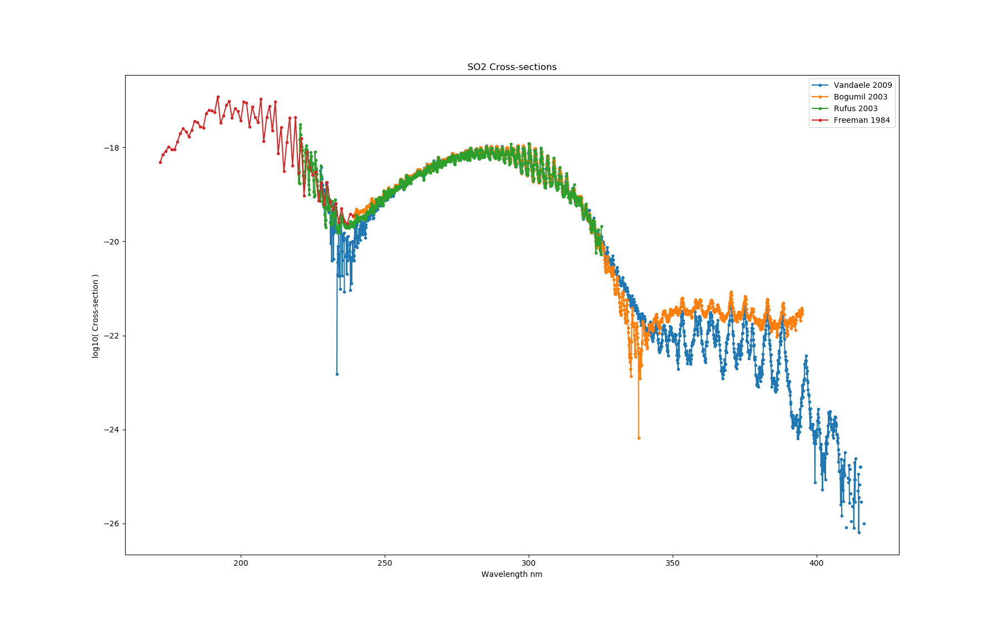
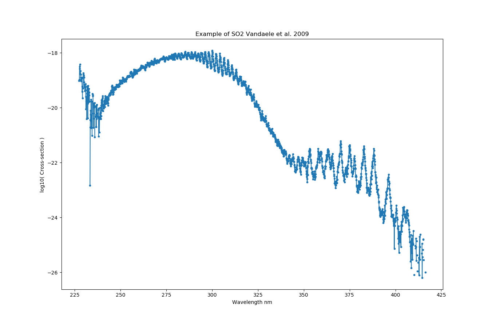
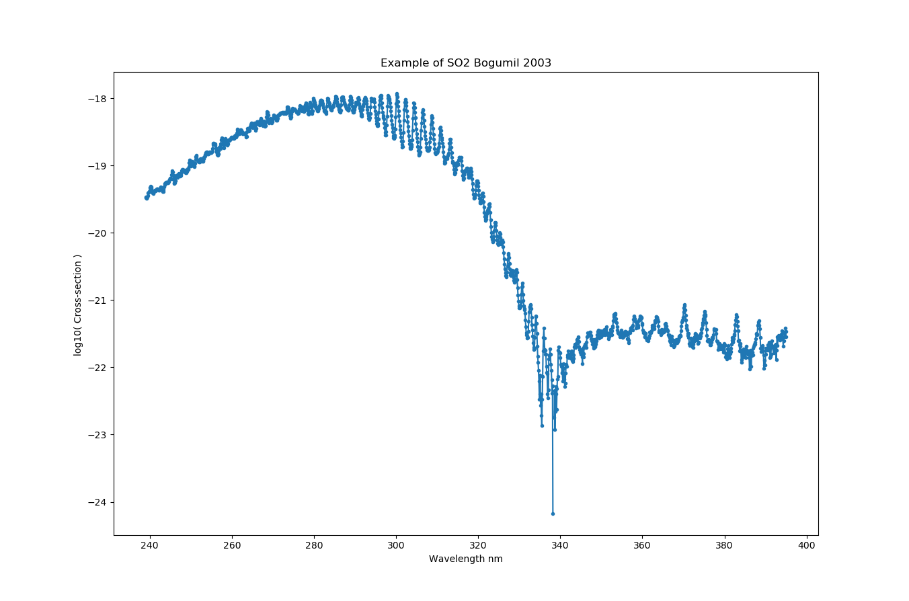
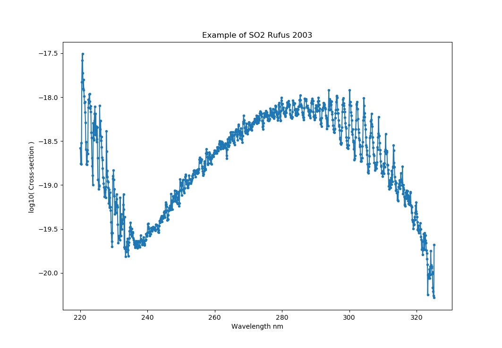
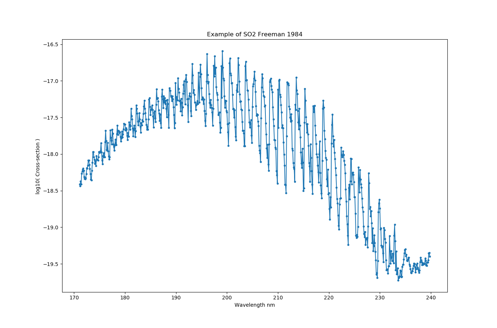

.. _optical_so2:

SO2
===
We have downloaded several SO2 cross-sections from the  `MPI-Mainz UV/VIS Spectral Atlas <http://satellite.mpic.de/spectral_atlas/>`_ and built optical corresponding optical properties within the sasktran core components. Our philosophy has been to present the cross-section data as measured
with no modification on our part. We thank the the people at the  Max-Planck Institute for Chemistry, Mainz, Germany for their excellent online database,

**Keller-Rudek**, H., Moortgat, G. K., Sander, R., and Sörensen, R.: The MPI-Mainz UV/VIS spectral atlas of gaseous molecules of atmospheric interest. *Earth Syst. Sci. Data*, **5**, 365–373, 2013, `DOI: 10.5194/essd-5-365-2013 <https://doi.org/10.5194/essd-5-365-2013>`_

.. _so2_vandaele_2009:

SO2_VANDAELE2009
----------------
High-resolution absorption measurements using a Fourier transform spectrometer at a resolution of 2 cm-1 at T = 298, 318, 338, 358 K,  p = 0.05 - 199 Torr, on the spectral interval 23500-44500 cm-1 (227.275 nm to 416.658 nm)::

    import sasktranif as skif
    import numpy as np
    import matplotlib.pyplot as plt

    optprop = skif.ISKOpticalProperty('SO2_VANDAELE2009')
    msis    = skif.ISKClimatology('MSIS90')
    mjd = 52393.3792987115;
    location = [0.0, 0.0, 25000.0, mjd]
    optprop.SetAtmosphericState( msis)
    optprop.SetLocation(location)
    wavelen = np.arange( 210,420, 0.1 )
    ok, abs, ext,sca = optprop.CalculateCrossSections( 1.0E7/wavelen )

    plt.plot( wavelen, np.log10(abs), '.-')
    plt.xlabel('Wavelength nm')
    plt.ylabel('log10( Cross-section ) ')
    plt.title('Example of SO2 Vandaele et al. 2009')
    plt.show()

C. Hermans, A. C. Vandaele, and S. Fally. "Fourier transform measurements of SO2 absorption cross sections:I. Temperature dependence in the 24000-29000 cm-1 (345-420 nm) region,". *J. Quant. Spectrosc. Radiat. Transfer*, **110**, 756-765 (2009); `doi:10.1016/j.jqsrt.2009.01.031 <https://doi.org/10.1016/j.jqsrt.2009.01.031>`_

A. C. Vandaele, C. Hermans, and S. Fally. "Fourier transform measurements of SO2 absorption cross sections:II. Temperature dependence in the 29000-44000 cm-1 (227-345 nm) region,". *J. Quant. Spectrosc. Radiat. Transfer* **110**, 2115-2126 (2009); `doi:10.1016/j.jqsrt.2009.05.006 <https://doi.org/10.1016/j.jqsrt.2009.05.006>`_

..  _so2_bogumil_2003:

SO2_BOGUMIL2003
---------------
SO2 cross-sections measured at the resolution of the SCIAMACHY PFM spectrometer from 239 nm to 395 nm at 203 K, 223 K, 243 K, 273 K and 293 K. with a spectral resolution of 0.21 to 0.22 nm.
Spectral regions are cut and concatenated at 251.1 nm and 312.8 nm by the authors and scaled to the absorption cross sections measured by Vandaele et al. 1994::

    import sasktranif as skif
    import numpy as np
    import matplotlib.pyplot as plt

    optprop = skif.ISKOpticalProperty('SO2_BOGUMIL2003')
    msis    = skif.ISKClimatology('MSIS90')
    mjd = 52393.3792987115;
    location = [0.0, 0.0, 25000.0, mjd]
    optprop.SetAtmosphericState( msis)
    optprop.SetLocation(location)
    wavelen = np.arange( 230,410,0.1 )
    ok, abs, ext,sca = optprop.CalculateCrossSections( 1.0E7/wavelen )

    plt.plot( wavelen, np.log10(abs), '.-')
    plt.xlabel('Wavelength nm')
    plt.ylabel('log10( Cross-section ) ')
    plt.title('Example of SO2 Bogumil 2003')
    plt.show()

K. Bogumil, J. Orphal, T. Homann, S. Voigt, P. Spietz, O.C. Fleischmann, A. Vogel, M. Hartmann, H., Bovensmann, J. Frerick, and J.P. Burrows, "Measurements of molecular absorption spectra with the SCIAMACHY pre-flight model: Instrument characterization and reference data for atmospheric remote sensing in the 230-2380 nm region", *J. Photochem. Photobiol. A: Chem.*, **157**, 167-184 (2003); `doi:10.1016/S1010-6030(03)00062-5 <https://doi.org/10.1016/S1010-6030(03)00062-5>`_

A.C. Vandaele, P.C. Simon, Guilmot. M., M. Carleer, and R. Colin, "SO2 absorption cross section measurement in the UV using a Fourier transform spectrometer," *J. Geophys. Res.*, **99**, 25599-25605 (1994); `doi:10.1029/94JD02187 <https://doi.org/10.1029/94JD02187>`_

..  _so2_rufus_2003:

SO2_RUFUS2003
--------------
High-resolution (0.0005-0.0032 nm) absorption cross sections from 220.0 to 325.2 nm  at 295K measured by using a Fourier transform spectrometer.
Absorption cross sectionsfrom CfA (Harvard-Smithsonian Center for Astrophysics)  `Molecular Databases <http://cfa-www.harvard.edu/amdata/ampdata/amdata.shtml>`_.::

    import sasktranif as skif
    import numpy as np
    import matplotlib.pyplot as plt

    optprop = skif.ISKOpticalProperty('SO2_RUFUS2003')
    msis    = skif.ISKClimatology('MSIS90')
    mjd = 52393.3792987115;
    location = [0.0, 0.0, 25000.0, mjd]
    optprop.SetAtmosphericState( msis)
    optprop.SetLocation(location)
    wavelen = np.arange( 210,350, 0.1 )
    ok, abs, ext,sca = optprop.CalculateCrossSections( 1.0E7/wavelen )

    plt.plot( wavelen, np.log10(abs), '.-')
    plt.xlabel('Wavelength nm')
    plt.ylabel('log10( Cross-section ) ')
    plt.title('Example of SO2 Rufus 2003')
    plt.show()

Rufus, J., Stark, G., Smith, P. L., Pickering, J. C., and Thorne, A. P.: High‐resolution photoabsorption cross section measurements of SO2, 2: 220 to 325 nm at 295 K, *J. Geophys. Res.*, **108**, 5011, (2003); `doi:10.1029/2002JE001931 <https://doi.org/10.1029/2002JE001931>`_, E2.

..  _so2_freeman1984:

SO2_FREEMAN1984
---------------
High resolution cross-sections measured from 171.079 nm to 239.860 at 213K at 0.002 nm resolution.::

    import sasktranif as skif
    import numpy as np
    import matplotlib.pyplot as plt

    optprop = skif.ISKOpticalProperty('SO2_FREEMAN1984')
    msis    = skif.ISKClimatology('MSIS90')
    mjd = 52393.3792987115;
    location = [0.0, 0.0, 25000.0, mjd]
    optprop.SetAtmosphericState( msis)
    optprop.SetLocation(location)
    wavelen = np.arange( 170.0, 240.0, 0.1 )
    ok, abs, ext,sca = optprop.CalculateCrossSections( 1.0E7/wavelen )

    plt.plot( wavelen, np.log10(abs), '.-')
    plt.xlabel('Wavelength nm')
    plt.ylabel('log10( Cross-section ) ')
    plt.title('Example of SO2 Freeman 1984')
    plt.show()

D.E. Freeman, K. Yoshino, J.R. Esmond, and W.H. Parkinson. "High resolution cross section measurements of SO2 at 213 K in the wavelength region 172 - 240 nm", *Planet. Space Sci.*, **32**, 1125-1134, (1984); `doi:10.1016/0032-0633(84)90139-9 <https://doi.org/10.1016/0032-0633(84)90139-9>`_

Examples
--------
Some examples::

    import sasktranif as skif
    import numpy as np
    import matplotlib.pyplot as plt

    optprop = skif.ISKOpticalProperty('SO2_VANDAELE2009')
    msis    = skif.ISKClimatology('MSIS90')
    mjd = 52393.3792987115;
    location = [0.0, 0.0, 25000.0, mjd]
    optprop.SetAtmosphericState( msis)
    optprop.SetLocation(location)
    wavelen = np.arange( 210,420, 0.1 )
    ok, abs, ext,sca = optprop.CalculateCrossSections( 1.0E7/wavelen )
    plt.plot( wavelen, np.log10(abs), '.-')

    optprop = skif.ISKOpticalProperty('SO2_BOGUMIL2003')
    msis    = skif.ISKClimatology('MSIS90')
    mjd = 52393.3792987115;
    location = [0.0, 0.0, 25000.0, mjd]
    optprop.SetAtmosphericState( msis)
    optprop.SetLocation(location)
    wavelen = np.arange( 230,410, 0.1 )
    ok, abs, ext,sca = optprop.CalculateCrossSections( 1.0E7/wavelen )
    plt.plot( wavelen, np.log10(abs), '.-')

    optprop = skif.ISKOpticalProperty('SO2_RUFUS2003')
    msis    = skif.ISKClimatology('MSIS90')
    mjd = 52393.3792987115;
    location = [0.0, 0.0, 25000.0, mjd]
    optprop.SetAtmosphericState( msis)
    optprop.SetLocation(location)
    wavelen = np.arange( 210,350, 0.1 )
    ok, abs, ext,sca = optprop.CalculateCrossSections( 1.0E7/wavelen )
    plt.plot( wavelen, np.log10(abs), '.-')

    optprop = skif.ISKOpticalProperty('SO2_FREEMAN1984')
    msis    = skif.ISKClimatology('MSIS90')
    mjd = 52393.3792987115;
    location = [0.0, 0.0, 25000.0, mjd]
    optprop.SetAtmosphericState( msis)
    optprop.SetLocation(location)
    wavelen = np.arange( 170.0, 240.0 )
    ok, abs, ext,sca = optprop.CalculateCrossSections( 1.0E7/wavelen )
    plt.plot( wavelen, np.log10(abs), '.-')

    plt.xlabel('Wavelength nm')
    plt.ylabel('log10( Cross-section ) ')
    plt.title('SO2 Cross-sections')
    plt.legend( ['Vandaele 2009','Bogumil 2003', 'Rufus 2003', 'Freeman 1984'] )
    plt.show()

