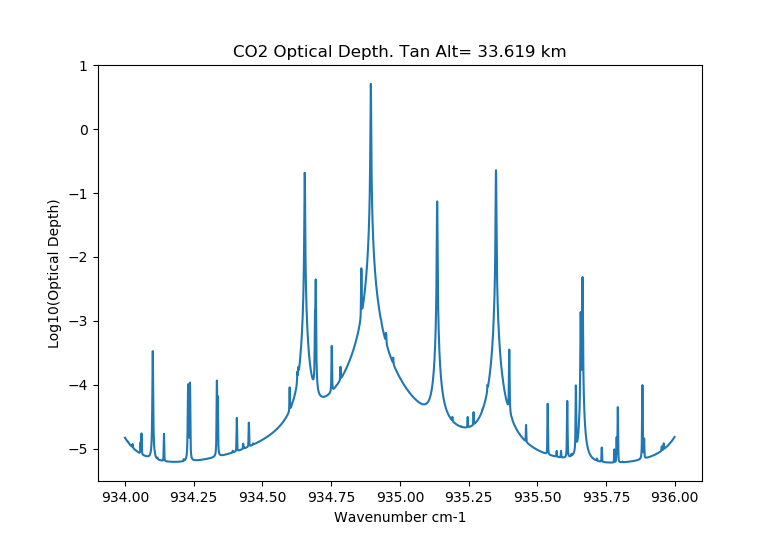

.. _engine:

Engine
======

Module: ``sasktran.engine``

Engines are objects that can calculate radiances. Some of these engines can also calculate
analytic or optimized :ref:`weighting_functions`. One of the primary design objectives of SASKTRAN
is to build a flexible radiative transfer framework so that the different components of a radiative 
transfer calculation are as modular as possible. This is our motivation for calling these objects
engines as opposed to radiative transfer algorithms. 

SASKTRAN's primary engine product is `SASKTRAN HR`_.

Base Class
----------

Engines require a :ref:`geometry` object, and an :ref:`atmosphere` object at a minimum to get the
gemetric and atmospheric specifications for the calculation.

.. autoclass:: sasktran.Engine
    :exclude-members: skif_object

.. note::

    Most engines have a lot of features and configuration options. We have tried to make engine 
    default configurations as reasonable as possible but obviously these defaults cannot efficiently
    handle every possible case. Because of this, users have to be aware additional engine 
    configuration might be necessary to obtain efficinent and accurate results. These additional
    configuration options are set through engine options (see :py:attr:`sasktran.Engine.options`).

SASKTRAN HR
-----------

SASKTRAN HR is our primary engine product. The HR engine solves the radiative transfer equation 
in a region of interest using the successive orders technique on a true spherical Earth. The main
highlights of the engine are:

* Support to calculate the :ref:`weighting_functions` of target species
* Adapative integration within optically thick regions
* Polarized or scalar radiance calculations
* Support for gradients across a region of interest using high resolution diffusive fields
* Support for terminator conditions
* Support for thermal emissions
* Support for elevated surface topology

.. autoclass:: sasktran.EngineHR

.. autoclass:: sasktran.EngineHRSSApprox

Additional Documentation
    For additional documentation and options see: https://arg.usask.ca/docs/SasktranIF/hr.html.

SASKTRAN-DISCO
--------------
SASKTRAN Disco is a radiative transfer engine similar to the well known DISORT and LIDORT
radiative transfer algorithms. Full documentation can be found at https://arg.usask.ca/docs/sasktran_do/.

SASKTRAN-OCC
-------------
An occultation engine.  This engine calculates the optical depth along a curved line of sight in the atmosphere.

    Figure generated from the data generated by the example given below.

.. autoclass:: sasktran.EngineOCC

SASKTRAN-MC
-----------
SASKTRAN MC is a fully spherical Monte Carlo radiative transfer engine, primarily used as a slow but accurate calibration for HR. It contains additional features as well, namely air mass factor calculation and rotational Raman scattering.

.. autoclass:: sasktran.EngineMC

SASKTRAN-SO
-------------
An older successive order engine written for limb viewing radiative transfer calculations. This was the first engine
written for sasktran and it still works although it is no longer actively maintained. It has been superceded by the HR
engine which has all of the SO functionality.

.. autoclass:: sasktran.EngineSO

See Also
--------
.. include:: descriptions/geometry.desc
.. include:: descriptions/atmosphere.desc
