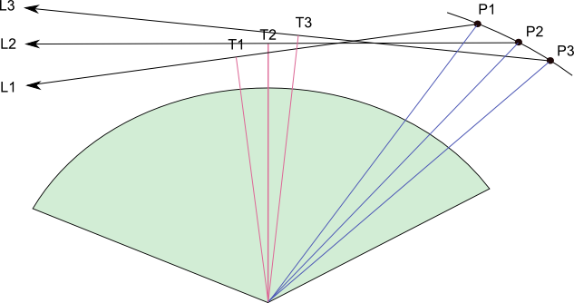
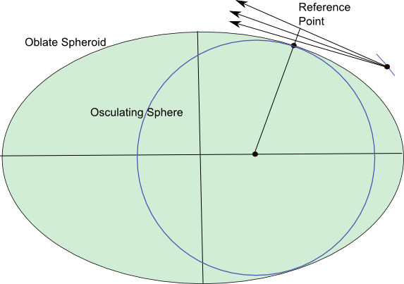

*********************************
Limb Geometry Overview and Setup
*********************************

A typical limb-viewing geometry is shown in the figure below where a satellite is orbiting the Earth at locations P1, P2 and P3.
At each location an instrument looks towards the atmospheric limb in directions L1, L2, L3 observing tangent points T1, T2 and T3.

The ``HR`` engine is used to calculate the vector or scalar radiance observed by the instrument at each location. There
is a huge computational saving if we assume all measurements are sufficiently close together that they essentially occur
at the same instant with the same solar illumination conditions. If we can make this assumption
then we only have to solve the diffuse radiative field once and can quickly integrate through the field for
each line of sight. If the assumption is not valid then the calculation must be broken down into smaller subsets
and the ``HR`` engine re-configured for each separate illumination condition.

We generally use 2 minutes as a reasonable period to consider measurements instantaneous. This period is the time taken for the Sun to
move one solar disk, or 0.5 degrees, across the sky (assuming 15 degrees/hour). This seems a reasonable limit given that the 0.5 degree, finite
size of the Sun is not generally accounted for in the ``HR`` engine.

Lines of Sight
-----------------
All ``sasktranif`` engines assume you can define each line of sight with:

  1. the position (P1, P2, P3) of the observer as (X,Y,Z )vectors from the center of the oblate Earth.
  2. the look direction (L1, L2, L3) away from the observer as unit vectors.
  3. the time of the measurements as a modified julian date. This condition is relaxed if you know the direction of the Sun and all climatologies are time independent.

X is a horizontal unit vector in the equatorial plane of the oblate Earth from the centre of the Earth towards 0 degrees longitude,
Z is a unit vector parallel to the Earth's spin axis and Y forms the third vector of a right-handed system. This system works well
for many observational data sets but if you have a different way of specifying the same information then  class :class:`ISKGeodetic`
has been written to help you convert to the required system. Let us know if :class:`ISKGeodetic` is lacking the functionality you need.

Sun Direction
----------------
You will normally **not** specify the unit vector of the Sun as the ``HR`` engine by default will calculate the Sun's position using the
average of the modified julian dates (mjd) of the lines of sight. You must override the default setting if you are creating test
lines of sight and/or want to explicitly set the position of the sun. The sun position is specified as a unit vector from the centre of the Earth toward the Sun
using the same X,Y,Z corodinate system as the observer coordinates.

Reference Point and Osculating Sphere
----------------------------------------
The ``HR`` model approximates the shape of the Earth to be a sphere. The radius of the sphere is chosen so it matches the radius of curvature of the Earth at
a **Reference Point**. This sphere is called the osculating sphere as it kisses the true oblate Earth at the reference point, see figure below. The **Reference Point** is normally chosen
from the average of the tangent point or ground intersection of each line of sight.

The centre of the osculating sphere is offset from the centre of the true oblate Earth and the ``HR`` engine creates an internal coordinate transformation
that maps positions from one system to the other and vice-versa. The transformation from true oblate Earth to osculating sphere coordinates generates a small height registration
difference for locations not directly above the reference point. This is important as lines of sight not tangent at the reference point will have a tangent height slightly higher
in the osculating system than in the oblate system. By default the ``HR`` engine adjusts the look vector of lines of sight which are tangential within the true oblate atmosphere so they look at the
same tangent height in the osculating system.

Surface Height and TOA
--------------------------
By default the ``HR`` engine will assume the surface of the Earth is at 0 meters above mean sea-level and the top of the atmosphere is at 100 kilometers (100,000 m).
Both the lower and upper altitudes can be set to other values using properties **TOAHeight** and **SurfaceHeight**. Lowering the upper altitude can have a significant
positive impact upon performance as it reduces the size of the diffuse field.

Polarization
------------
The ``HR`` engine supports calculation of either scalar radiances or full stokes vectors, see property
:meth:`~ISKEngine.SetPolarizationMode`.  The polarization calculation is done through an approximation--for low orders
of scatter the full calculation is performed, while higher orders of scatter are assumed to have a specific
polarization state.  The level of approximation used is controlled through calling :meth:`~ISKEngine.SetPolarizationMode`.

There are two functions that perform the radiative transfer calculation, :meth:`~ISKEngine.CalculateRadiance` and
:meth:`~ISKEngine.CalculateStokesVector`.  These **do not** determine whether or not a polarized calculation is performed, they
only determine the final return type:  :meth:`~ISKEngine.CalculateRadiance` returns a two dimensional array
of scalar values representing :math:`I` while :meth:`~ISKEngine.CalculateStokesVector` returns a two dimensional
array of :class:`ISKStokesVector` objects.  Whether or not a polarization calculation is done or not is determined entirely
by :meth:`~ISKEngine.SetPolarizationMode`.

.. _hrscatterorder:

Number of Scatter Orders
------------------------
The successive orders algorithm successively calculates higher orders of scatter using the previous order of scatter.
The maximum number of scatter orders calculated is set through::

    ok = engine.SetProperty('numordersofscatter', n)

where ``n`` is the number of scatter orders.  The default value is ``n=50``.

Caching is done in the ``HR`` engine which makes the second order of scatter take the longest time to run.  All orders
after the second are relatively quick.  Furthermore, convergence checking is done internally in the engine which
stops the calculation when rays stop contributing to the final answer.  For these reasons it is recommended to use
either ``n=1`` (for a quick not-accurate calculation) or ``n=50`` (for the full calculation).

.. _hrdiffuse:

Diffuse Profiles
----------------
The primary option that controls the accuracy of the ``HR`` radiative transfer calculation is the
number of *diffuse profiles*.  Each diffuse profile represents a single solar zenith angle where the multiple
scattering source function is calculated.  By default, only one diffuse profile is used in the calculation and
is placed at the solar zenith angle of the average tangent point.  Whether or not this is appropriate is heavily
dependant on a variety of factors

* Wavelength -- Wavelengths where the atmosphere is thick and there is little absorption (e.g. around 350 nm) have a large amount of multiple scatter and are more sensitive to the number of diffuse profiles.
* Solar zenith angle span -- Since the multiple scattering source function varies with solar zenith angle, lines of sight which have a large solar zenith angle span will be sensitive to the number of diffuse profiles.  Solar scattering angle is a rough proxy of this effect.  Forward and backward scatter geometries will be most sensitive to the number of diffuse profiles, while scattering angles near :math:`90^\circ` will see no effect.
* Solar zenith angle -- The absolute solar zenith angle also effects the optimal number of diffuse profiles.  The multiple scattering source function is slowly varying for low solar zenith angles (sun high in the sky) and varies rapidly at high solar zenith angles near the solar terminator.  Generally, more diffuse profiles are required the closer you get to the terminator.
* What the radiance is being used for -- Often times the absolute radiance is not the quantity of interest.  For example, in many retrievals radiances are normalized by high altitude measurements.  This normalization process removes a lot of the dependence on the number of diffuse profiles.

The number of diffuse profiles can be changed in the ``HR`` option through::

    ok = engine.SetProperty('numdiffuseprofilesinplane', n)

where ``n`` is the number of diffuse profiles.  Calculation time scales roughly linearly with the number of diffuse
profiles; a calculation with 5 diffuse profiles will take approximately 5 times as long as a calculation with 1
diffuse profile.  RAM usage scales the same way.

Figuring out the optimal number of diffuse profiles for a specific situation is an important and difficult problem.
As a first step, we recommend switching between ``n=1`` and ``n=5`` and seeing how the results change.  As an
additional tool, radiances can be benchmarked against the ``MC`` engine to verify that the number of diffuse
profiles used is sufficient.

.. _hrweightingfunctions:

Weighting Functions
-------------------
The HR engine supports analytical computation of weighting functions for absorbing and scattering species.
The theoretical basis for the method is described in [Zawada2015]_. Prior to calculating weighting functions it is
necessary to both tell the engine to calculate weighting functions, and specify the species we are calculating
weighting functions for.

Example::

    import sasktranif.sasktranif as skif
    engine = skif.ISKEngine('HR')

    # Set up lines of sight/wavelengths/atmosphere

    optprop_o3 = skif.ISKOpticalProperty('O3_DBM')
    ok = engine.SetProperty('WFSpecies', optprop_o3)
    ok = engine.SetProperty('calcwf', 2)
    ok, rad = engine.CalculateRadiance()
    ok, wf = engine.GetWeightingFunctions()

The ``wf`` object that is returned is a three dimensional ``numpy.ndarray`` with dimensions corresponding to
``[wavelength, line of sight, volume]``,

.. math::

    \texttt{wf[i, j, k]} = \frac{\partial I(\lambda_i, \text{LOS}_j)}{\partial x_k},

and has units of ``[radiance/cm^{-3}]``.  In our example, the quantity :math:`x_k` is the ozone number density
over a finite volume.  Since we set ``calcwf = 2`` the finite volumes are uniform spherical shells spaced ``1 km`` apart evenly
from ``0.5 km`` to ``99.5 km``.  Therefore, the quantity ``wf[i, j, 10]`` can be thought of as the derivative of
the radiance (for wavelength ``i`` and line of sight ``j``) with respect to changing ozone number density in the
``10.5 km`` shell.

*Notes*

Currently the model is limited to calculating weighting functions for one species at a time.  This is normally
not an issue, since typically wavelengths used for retrievals are sensitive to only one species.

The weighting function species does not have to be a species that was added to the model.

Weighting functions are not calculated by assuming a constant perturbation within the specified finite volume.
Rather, the returned quantity should be thought of as the derivative of radiance with respect to how ``HR`` responds
to changes in that volume.  For example, when the finite volume is spherical shells, linear interpolation is done between
the shell directly above and below the specified shell to better represent how the radiative transfer calculation is done.

Standard Mode
^^^^^^^^^^^^^
This is the recommended mode for weighting function calculations using a one dimensional (spherically symmetric) atmosphere, and is
set through::

    ok = engine.SetProperty('calcwf', 2)

Weighting functions are calculated on a grid of spherical shells.  By default this is an evenly spaced grid
from ``0.5 km`` to ``99.5 km`` in steps of ``1 km``; i.e. the returned ``wf`` object will have dimensions
``(len(wavel), len(lineofsight), 100)``, and the quantity ``wf[i, j, 10]`` can be thought of as the derivative of
the radiance (for wavelength ``i`` and line of sight ``j``) with respect to changing number density in the
``10.5 km`` shell.

The shell locations and widths can be changed through the properties ``wfheights`` and ``wfwidths``::

    wfwidths = [2000, 2000, 2000, 2000]
    wfheights = [10000, 20000, 30000, 40000]

    engine.SetProperty('wfwidths', wfwidths)
    engine.SetProperty('wfheights', wfheights)

Weighting functions will now be calculated for spherical shells centred at ``[10 km, 20 km, 30 km, 40 km]`` with
widths of ``2 km``.

Line of Sight Mode
^^^^^^^^^^^^^^^^^^
The line of sight weighting function mode is a special mode where weighting functions are calculated on the tangent
altitude grid of the lines of sight.  This can be useful for some retrieval algorithms and is set through::

    ok = engine.SetProperty('calcwf', 1)

The weighting functions returned has dimensions ``(len(wavel), len(linesofsight), len(linesofsight))`` and are centred
on the line of sight tangent altitudes.  The widths are chosen such that the spherical shell extends between the
line of sight directly below and the line of sight directly above.

Two Dimensional Mode
^^^^^^^^^^^^^^^^^^^^

Not yet written.

Other Options
^^^^^^^^^^^^^
While the computation time of weighting functions for a standard multiple scatter calculation is negligible
compared to the actual calculation, for some situations (e.g. single scatter in the IR region) the majority
of time could be spent calculating weighting functions.  For this reason we have added the option ``wfprecision``.

By default, weighting functions are calculated considering three effects:

* Line of sight
* Solar
* Higher Order

By setting::

    ok = engine.SetProperty('wfprecision', 1)

The solar and higher order effects are turned off, thus only line of sight contributions are accounted for.  This
degrades the quality of the weighting functions, but often they are still usable for retrieval purposes.

Three Dimensional Atmospheres
-----------------------------
The ``HR`` model supports calculations where atmospheric constituents are allowed to vary three dimensionally.

