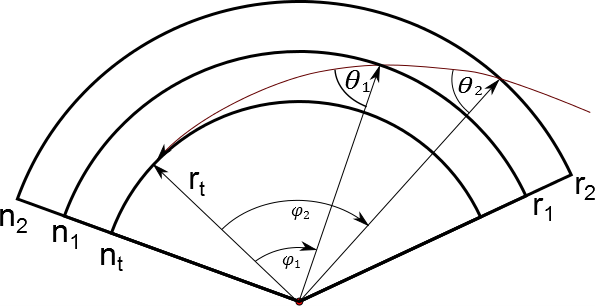
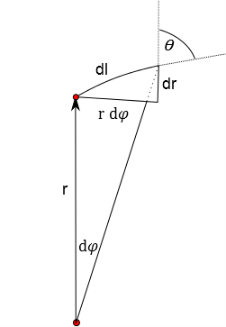

.. _engineocc:

***
OCC
***

The ``OCC`` engine was built as a radiative transfer model for solar occultation observations from a satellite. It was
originally built as a plug-in subsititute engine for the Fortran code used in the `ACE-FTS <http://www.ace.uwaterloo.ca/instruments_acefts.php>`_
analysis and is well-suited for atmospheric transmission calculations in near infra-red and infra-red micro-windows. The algorithm
traces curved rays using a spherically symmetric version of Snells law,  [Thompson1982]_. The refractive index of the
atmosphere follows the dry-air formula published by [Filippenko1982]_ which only requires a single profile of pressure
and temperature; we note that the atmospheric refractive index does not include effects due to moist air which
may be significant at tropospheric altitudes.

The code for the OCC engine was frequently compared to the original Fortran code during development to ensure
they are identical. The engine calculates transmission through the atmosphere, rather than radiance, and has
the following features:

    * curved ray tracing in a spherically symmetric atmosphere. The path length of the
      curved ray is the same as the ACE-FTS code to within 1 micron.
    * The code provides efficient calculation of Voigt profiles across micro-windows in the near infra-red and infra-red.

Examples
---------

 Here is C++ example::

    import numpy as np
    import matplotlib.pyplot as plt
    import sasktranif.sasktranif as skif

    #------------------------------------------------------------------------------
    #           MakeOpticalStateForOccultationHITRAN
    #------------------------------------------------------------------------------

    def MakeOpticalStateForOccultationHITRAN(  occengine : skif.ISKEngine, min_wavenum: float, max_wavenum : float):

        rayleigh         = skif.ISKOpticalProperty('Rayleigh' )
        msis90           = skif.ISKClimatology    ('MSIS90')
        co2numberdensity = skif.ISKClimatology    ('USERDEFINED_PROFILE')
        co2numberdensity.SetProperty('DoLogInterpolation', 1)

        co2profile =  np.array( [    0.000, 9.5620350469e+15,  1000.000, 8.5604676285e+15,  2000.000, 7.7062120091e+15,  3000.000, 6.9531991470e+15,  4000.000, 6.2702731320e+15,  5000.000, 5.6375862919e+15,
                        6000.000, 5.0651291274e+15,  7000.000, 4.4975838604e+15,  8000.000, 3.9468136861e+15,  9000.000, 3.4348048814e+15, 10000.000, 2.9871067830e+15, 11000.000, 2.5656416175e+15,
                       12000.000, 2.1874053365e+15, 13000.000, 1.8533816021e+15, 14000.000, 1.6023327829e+15, 15000.000, 1.3568375796e+15, 16000.000, 1.1279532788e+15, 17000.000, 9.7672446573e+14,
                       18000.000, 8.4173283897e+14, 19000.000, 7.1576699275e+14, 20000.000, 6.2070908062e+14, 21000.000, 5.2364297410e+14, 22000.000, 4.3181248841e+14, 23000.000, 3.7860567983e+14,
                       24000.000, 3.2428122678e+14, 25000.000, 2.7110791383e+14, 26000.000, 2.3526785090e+14, 27000.000, 2.0344493146e+14, 28000.000, 1.7304110039e+14, 29000.000, 1.4714113133e+14,
                       30000.000, 1.2544180466e+14, 31000.000, 1.0738346125e+14, 32000.000, 9.2442937053e+13, 33000.000, 8.0342242281e+13, 34000.000, 6.9455591820e+13, 35000.000, 5.9095214441e+13,
                       36000.000, 5.0374561563e+13, 37000.000, 4.3515754800e+13, 38000.000, 3.7794009046e+13, 39000.000, 3.2874895083e+13, 40000.000, 2.8685628465e+13, 41000.000, 2.4978923024e+13,
                       42000.000, 2.1682117851e+13, 43000.000, 1.8864809592e+13, 44000.000, 1.6431826141e+13, 45000.000, 1.4348899126e+13, 46000.000, 1.2595260698e+13, 47000.000, 1.1093125765e+13,
                       48000.000, 9.8376261311e+12, 49000.000, 8.8026864921e+12, 50000.000, 7.8993464447e+12, 51000.000, 7.0038829664e+12, 52000.000, 6.0771348455e+12, 53000.000, 5.2887296427e+12,
                       54000.000, 4.6787494256e+12, 55000.000, 4.1667051367e+12, 56000.000, 3.6751620506e+12, 57000.000, 3.1811011797e+12, 58000.000, 2.7604364326e+12, 59000.000, 2.4249492298e+12,
                       60000.000, 2.1420175118e+12, 61000.000, 1.8772791073e+12, 62000.000, 1.6195294613e+12, 63000.000, 1.3994285676e+12, 64000.000, 1.2229247260e+12, 65000.000, 1.0734951007e+12,
                       66000.000, 9.3270881894e+11, 67000.000, 7.9345730980e+11, 68000.000, 6.7795327304e+11, 69000.000, 5.9174431127e+11, 70000.000, 5.2173619614e+11, 71000.000, 4.5523334147e+11,
                       72000.000, 3.8840635314e+11, 73000.000, 3.3304529951e+11, 74000.000, 2.9045416707e+11, 75000.000, 2.5517516779e+11, 76000.000, 2.2127024526e+11, 77000.000, 1.8582366434e+11,
                       78000.000, 1.5596546276e+11, 79000.000, 1.3362547386e+11, 80000.000, 1.1541990113e+11, 81000.000, 9.8756976417e+10, 82000.000, 8.2629944315e+10, 83000.000, 6.8563739750e+10,
                       84000.000, 5.6814363571e+10, 85000.000, 4.6797966799e+10, 86000.000, 3.8795906044e+10, 87000.000, 3.2908654369e+10, 88000.000, 2.7811184596e+10, 89000.000, 2.2974282383e+10,
                       90000.000, 1.8716304570e+10, 91000.000, 1.5254396937e+10, 92000.000, 1.2548308770e+10, 93000.000, 1.0295593615e+10, 94000.000, 8.3338827301e+09, 95000.000, 6.6488536883e+09,
                       96000.000, 5.2936443303e+09, 97000.000, 4.2242029799e+09, 98000.000, 3.3594428424e+09, 99000.000, 2.6511281727e+09]).reshape( [100,2])

        ok1 = co2numberdensity.SetProperty('Heights', co2profile[:,0])
        ok2 = co2numberdensity.SetPropertyUserDefined('SKCLIMATOLOGY_CO2_CM3', co2profile[:,1])

        co2_opticalprops = skif.ISKOpticalProperty('HITRANCHEMICAL_CO2')
        ok3 = co2_opticalprops.SetProperty( 'SetWavenumberRange', (min_wavenum, max_wavenum) )

        ok4 = occengine.AddSpecies( 'SKCLIMATOLOGY_AIRNUMBERDENSITY_CM3', msis90, rayleigh)
        ok5 = occengine.AddSpecies( 'SKCLIMATOLOGY_CO2_CM3', co2numberdensity, co2_opticalprops  )

    #------------------------------------------------------------------------------
    #           test_occ_engine
    #------------------------------------------------------------------------------

    def test_occ_engine():

        min_wavenumber = 934.0                  # minimum wavenumber in cm-1
        max_wavenumber = 936.0                  # maximum wavenumber in cm-1
        res_wavenumber = 0.0005                 # wavenumber resolution in cm-1

        mjd = 54242.26386852                    # MJD("2007-05-22 06:19:58.24") Use ACE-FTS scan ace.sr20314 as an example.
        latitude = 68.91
        longitude = -79.65
        observeralt = 600000.0
        tanalts = np.array( [ 95.542934418655, 93.030998230911, 90.518486023880, 87.999366761185, 85.485855103470, 82.971916199661, 80.457603455521, 77.942962647415, 75.421955109573, 72.906806946732,
                     70.391479493118, 67.869934082962, 65.354396820999, 62.838825226761, 60.317182541824, 57.801700592972, 55.286336899734, 52.765050888992, 50.250070572830, 47.735359192825,
                     45.220966340042, 42.682148825007, 40.254586233282, 37.901745439957, 35.689252976524, 33.619203107470, 31.633878541417, 29.706157206720, 27.941217916525, 26.315136637345,
                     24.759740931714, 23.273057386890, 21.701357220703, 20.435203333687, 19.296175927224, 18.238125008002, 17.137857798933, 15.665431416870, 14.623809766528, 13.581115284387,
                     12.793781944543, 11.901170623281, 10.978181776555, 10.1851695349872, 9.4383271471788, 8.7424541473265, 8.0540969039894, 7.5483134223615, 7.0824804787830, 6.7903857771487,
                     6.3015475934096] )*1000.0

        shellheights = np.arange( 0.0, 95000.0, 1000.0 )
        wavenumber = np.arange( min_wavenumber, max_wavenumber, res_wavenumber)
        wavelen    = 1.0E7/wavenumber
        occengine  = skif.ISKEngine('OCC')
        ok1 = occengine.SetWavelengths( wavelen )
        ok2 = occengine.SetProperty( 'SetReferencePoint', ( latitude, longitude, 50000.0, mjd ) )
        ok3 = occengine.SetProperty( 'SetRayTracingShells', shellheights  )

        for h in tanalts:
            ok4 = occengine.SetProperty( 'AddLineOfSightFromTangentAlt', [h, observeralt] )             # Add a line of sight based upon the tangent altitude
        MakeOpticalStateForOccultationHITRAN( occengine, min_wavenumber, max_wavenumber )
        [ok,extinction] = occengine.CalculateRadiance()
        plt.plot( wavenumber, extinction[25,:])
        plt.show()

Properties
----------
..  py:module:: OCC

=================================================   ===================================================================
Properties                                          Description
=================================================   ===================================================================
:py:func:`~OCC.SetReferencePoint_TargetAltitude`    Set reference point from a target altitude
:py:func:`~OCC.SetReferencePoint_TargetRange`
:py:func:`~OCC.SetGroundAltitude`                   Set the altitude o fthe ground
:py:func:`~OCC.SetUpperBoundAltitude`               Set the upper altitude used in calculations
:py:func:`~OCC.SetLowerBoundAltitude`               Set the lowe altitude used in calculations
:py:func:`~OCC.SetRayTracingWaveNumber`             The wavenumber used to calculate refraction in the atmosphere
:py:func:`~OCC.SetReferencePoint`                   Manually set the reference point location
:py:func:`~OCC.SetSun`                              Manually set the location of the Sun
:py:func:`~OCC.AddLineOfSightFromTangentAlt`        Add a line of sight
:py:func:`~OCC.SetRayTracingShells`                 Set the heights of the ray tracing shells.
=================================================   ===================================================================

..  _SetReferencePoint_TargetAltitude:

SetReferencePoint_TargetAltitude
^^^^^^^^^^^^^^^^^^^^^^^^^^^^^^^^
..  py:function:: SetReferencePoint_TargetAltitude( double value)

    Sets the target altitude to be used when determining the reference point. The
    target altitude is used in zenith and nadir observations to find the location
    where a ray intersects this altitude. This altitude is then used to find an
    average reference point location. The target altitude is used with the
    target range variable in limb viewing geometries to apply an increased weighting to
    lines of sight tangential in the vicinity of the target altitude. This encourages
    the reference point to be closer to the lines of sight which are tangential in the
    region of the reference point.

SetReferencePoint_TargetRange
^^^^^^^^^^^^^^^^^^^^^^^^^^^^^
..  py:function:: SetReferencePoint_TargetRange(double value)

    Sets the reference point target range parameter. This variable is only used
    when calculating the reference point from limb viewing geometries. Specifies the altitude range above and below
    the target altitude for enhanced weighting of limb viewing lines of sight, default 15000 meters.

SetGroundAltitude
^^^^^^^^^^^^^^^^^
..  py:function:: SetGroundAltitude(double value)

    Sets the altitude in meters of the ground shell above the oblate spheroid.

SetUpperBoundAltitude
^^^^^^^^^^^^^^^^^^^^^
..  py:function:: SetUpperBoundAltitude(double value)

    the maximum altitude of the atmosphere in meters used when considering the reference point

SetLowerBoundAltitude
^^^^^^^^^^^^^^^^^^^^^
..  py:function:: SetLowerBoundAltitude(double value)

    the minimum altitude of the atmosphere in meters used when considering reference point

SetRayTracingWaveNumber
^^^^^^^^^^^^^^^^^^^^^^^
..  py:function:: SetRayTracingWaveNumber( float wavenumber)

    Sets the wavenumber in cm-1 used for tracing curved rays through the atmosphere. Rays are only traced once
    in each model and the trajectories are shared between all wavenumber extinction calculations.

    :param float wavenumber:
        The wavenumber in cm-1 used for ray tracing calculations.

SetReferencePoint
^^^^^^^^^^^^^^^^^
..  py:function:: SetReferencePoint ( array position )

    Manually set the reference point to this location.

    :param array[3] position:
        A three element array specifing [latitude, longitude, mjd]

SetSun
^^^^^^
..  py:function:: SetSun( array position )

     Manually set the unit vector from the Earth to the Sun. A three element array specifing the unit vector from the
     Earth to the Sun [x,y,z] in the global geographic coordinate system.

AddLineOfSightFromTangentAlt
^^^^^^^^^^^^^^^^^^^^^^^^^^^^
..  py:function:: AddLineOfSightFromTangentAlt( array tangentheight)

    Adds a line of sight generated from the tangent height and aobserver height.

    :param array[2] tangentheight:
        A two element array specifying the target tangent height and observer height. Both are in meters.

SetRayTracingShells
^^^^^^^^^^^^^^^^^^^

..  py:function:: SetRayTracingShells( array heights)

    Specifies the heights of the shells used in the model. By default shells are 1000 m apart.

    :param array[n] shells:
        An array that specifies the height in meters of each shell above the oblate spheroid. The array must be
        in ascending order.

Background Theory
-----------------
This section of work complements the ray tracing work described in [Thompson1982]_. Consider a ray entering a spherically
symmetric atmosphere  where the refractive index of the atmosphere is only a function radius, :math:`n=n(r)`, see Figure 1.
The ray follows a curved trajectory due to the vertical gradient in refractive index and eventually reaches a tangent
point at radial height, :math:`r_t`.

    Figure 1. Schematic of ray tracing in a spherically symmetric atmosphere. The tangent point occurs at radius :math:`r_t`.

The propagation of rays through the atmosphere is governed by Bouger’s rule,

.. math::

    n\:r\sin \theta = k

where :math:`k` is a constant of the ray trajectory. At the tangent point, :math:`r_t`, we have by definition :math:`\theta = \frac{\pi}{2}`,
which upon substitution gives the constant :math:`k`,

..   math::

    k = n_t\:r_t

Similarly the constant, :math:`k`, can be found for an observer outside the atmosphere at location, :math:`r_0` we get,

..   math::

    k = r_0\sin \theta_0

Combining the two methods we get,

..  math::

    r_t = \frac{r_0\sin \theta_0}{n_t}

This provides us with a quick way to find the tangent point, :math:`r_t`, given the observers location and the zenith
angle of the ray at the observer. The refractive index at the tangent point, :math:`n_t`, is not truly known unless :math:`r_t`
is known but experience shows that for a realistic atmosphere an iterative approach rapidly converges on the actual tangent point.

It is simple to apply Bouger's law to find the curved trajectory as a function of radius, :math:`r`, and zenith
angle, :math:`\theta`, but this is not the correct formulation for calculating the location, :math:`(r,\phi)`, and curved
path length, :math:`L`, of the trajectory. For that, we need to consider the trajectory as a function of radius, :math:`r`
and azimuth angle, :math:`\phi`. Consider the differential path length, :math:`\mathrm{d}l`, shown below in Figure 2.

    Figure 2, Differential path length :math:`\mathrm{d}l` and its relationship to angles :math:`\theta` and :math:`\phi`

We can use trigonometry to establish the differential geometry,

..  math::
    \begin{eqnarray}
    \mathrm{d}l     &=& \frac{r\mathrm{d}\phi}{\sin \theta} \\
                    &=& \frac{\mathrm{d}r}{\cos \theta}
    \end{eqnarray}

which upon substitution gives,

..  math::
    \mathrm{d}\phi = \mathrm{d}r\frac{\tan \theta}{r}

From Bouger's law we can write

..  math::

    \sin \theta = \frac{k}{nr}

and it immediately follows from trigonomtery

..  math::

    \begin{eqnarray}
    \tan \theta &=& \frac{k}{ \sqrt{ (nr)^2 - k^2} } \\
    \cos \theta &=& \frac{ \sqrt{(nr)^2 - k^2} }{nr}
    \end{eqnarray}

Thus the change in angle, :math:`\mathrm{d}\phi`, as the ray moves along the curved trajectory in the atmosphere from one
shell radius, r1 to another r2 is given by the integral,

..  math::
    \begin{eqnarray}
    \phi &=& \int \mathrm{d}\phi \\
    \phi &=& \int_{r_1}^{r_2} \frac{k}{r\sqrt{ (nr)^2 - k^2}} \mathrm{d}r \\
    \end{eqnarray}

and the curved path length is given by the integral of the differential path length, :math:`\mathrm{d}l = \frac{r\mathrm{d}\phi}{\sin \theta}`

..  math::

    L = \int_{r_1}^{r_2} \frac{\mathrm{d}r}{\sqrt{ 1 - (\frac{k}{nr})^2}}

The two above formulae  for calculating azimuth, :math:`\phi` and total path length, :math:`L` have a numerical problem at
the tangent point as the denominator of the integrand for either case goes to zero and numerical evaluation of the integral
fails. To avoid this numerical difficulty we perform a change of variable. Let

..  math::

    \cos \psi = \frac{k}{nr}

Then differentiating with respect to :math:`r` and remembering that :math:`n` is a function of :math:`r` then

..  math::
    \dfrac{d}{dr}(\cos \psi) = k \dfrac{d}{dr}(n^{-1}r^{-1})

.. math::

    -\sin \psi \dfrac{d\psi}{dr} = k( -r^{-1}n^{-2}\dfrac{dn}{dr} - n^{-1}r^{-2})

..  math::
    \frac{\sin \psi}{k}\dfrac{d\psi}{dr} = \frac{1}{nr}\left(\frac{1}{n}\dfrac{dn}{dr} + \frac{1}{r}\right)

Or

..  math::

    \mathrm{d}r = \frac{\sin \psi}{\cos \psi}\frac{1}{\left( \frac{1}{n}\dfrac{dn}{dr} +\frac{n\cos\psi}{k}\right)}

then

..  math::

    \phi =  \frac{k}{ n(\frac{k}{n\cos\psi})^2\sqrt{1-cos^2\psi} }\frac{sin\psi}{\cos\psi}\frac{1}{( \frac{1}{n}\dfrac{dn}{dr} +\frac{n\cos\psi}{k})}\:\mathrm{d}\psi

and

..  math::

    L = \int_{\psi_1}^{\psi_2} \frac{1}{\sin\psi}\frac{\sin\psi}{\cos\psi}\frac{1}{\left(\frac{1}{n}\dfrac{dn}{dr} + \frac{n\cos\psi}{k}\right)     }\:\mathrm{d}\psi

These equations can be reduced to give formulations for :math:`\phi` and :math:`L` as,

..  math::
    :label: Eq 1

    \phi = \int_{\psi_1}^{\psi_2} \frac{ n^2\cos\psi}{\left( k\dfrac{dn}{dr}+n^2\cos\psi\right)}\:\mathrm{d}\psi

..  math::
    :label: Eq 2

    L = \int_{\psi_1}^{\psi_2} \frac{nk}{\cos\psi\left(k\dfrac{dn}{dr}+n^2\cos\psi\right)}\:\mathrm{d}\psi

References
-----------

..  [Thompson1982] | **Dennis A. Thompson**, Theodore J. Pepin, and Frances W. Simon. Ray tracing in a refracting spherically symmetric atmosphere. J. Opt. Soc. Am., 72(11):1498–1501, Nov 1982. URL: http://www.osapublishing.org/abstract.cfm?URI=josa-72-11-1498, doi:10.1364/JOSA.72.001498.

..  [Filippenko1982] | **A. V. Filippenko**. The importance of atmospheric differential refraction in spectrophotometry.  Publications of the Astronomical Society of the Pacific , 94:715–721, August 1982. doi:10.1086/131052.

