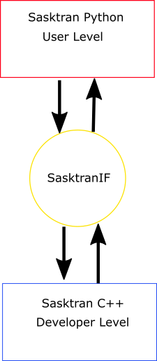

..  sasktranif documentation master file, created by
    sphinx-quickstart on Mon Nov  2 08:43:58 2015.
    You can adapt this file completely to your liking, but it should at least
    contain the root `toctree` directive.

#############################
SasktranIF, 4.x.x 2019-09-19
#############################

The SasktranIF (Sasktran Interface) API is part of the **Sasktran** suite of software for performing high precision
scientific radiative calculations within the Earth's atmosphere and is primarily aimed at the atmospheric community.

Purpose
-------
SasktranIF is a middle layer of software which binds the Sasktran python interfaces to C++ code. Most Sasktran users do not
use this layer directly but interact with it via the ``Sasktran`` package. It provides standardized
C++ interfaces which permit the independent development and distribution of Sasktran extensions as separate python
packages.

SasktranIF defines a small set of C++ interfaces and functions that are both Python and C++ friendly and can be
implemented at a binary level. The C++ developers write small wrapper objects for their internal C++ Sasktran
objects so they can be passed to Python users via the SasktranIF interface. The C++ developer can embed as many Sasktran objects
as they wish within a given extension, each object is provided by the developer with a unique name and a small set of
standard factory functions within the extension are used to create specific instances.

Background
------------
The code was originally developed by the `ARG <https://arg.usask.ca/>`_ group in the Dept. of Physics and Engineering Physics at the University
of Saskatchewan in the first decade of the millenium as the forward model for limb retrievals of ozone, aerosols and
NO2 from measurements collected by the Odin-OSIRIS UV-VIS instrument on-board the Odin spacecraft. It is currently
available for 64 bit editions of Python3 on both Linux (manylinux) and Windows.

..  toctree::
    :maxdepth: 3

    interfaces/interfaces
    extensions/modules
    developers/developers
    engines
    climatologies
    optproperties
    brdf
    solar
    emissions
    climatology_handles

Indices and tables
==================

* :ref:`genindex`
* :ref:`modindex`
* :ref:`search`

