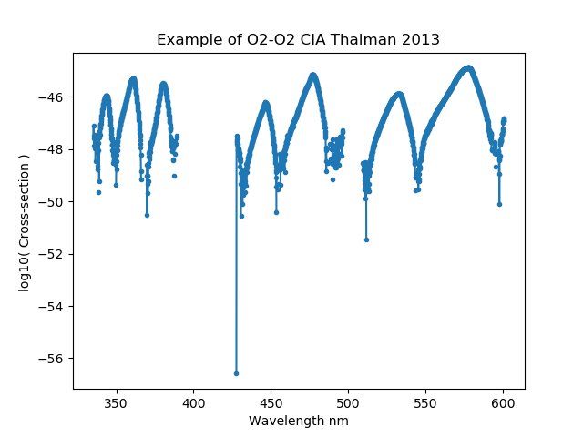

.. _optical_o4:

O2-O2 CIA
==========
We have optical property objects for the O2-O2 collision induced absorption. The data have been downloaded from the  `MPI-Mainz UV/VIS Spectral Atlas <http://satellite.mpic.de/spectral_atlas/>`_
and we have built optical corresponding optical properties within the sasktran core components. Our philosophy has been to present the cross-section data as measured
with no modification on our part. We thank the the people at the Max-Planck Institute for Chemistry, Mainz, Germany for their excellent online database,

**Keller-Rudek**, H., Moortgat, G. K., Sander, R., and Sörensen, R.: The MPI-Mainz UV/VIS spectral atlas of gaseous molecules of atmospheric interest. *Earth Syst. Sci. Data*, **5**, 365–373, 2013, `DOI: 10.5194/essd-5-365-2013 <https://doi.org/10.5194/essd-5-365-2013>`_

..  _o2_o2_hitran2016:

O2_O2_HITRAN2016
----------------
The O2-O2 collision induced absorption cross-sections distributed in Hitran 2016 as described by Karman et al. 2019.  It is composed of
8 spectral regions measured by several researchers that extend from 335nm to over 8 microns. Some of the regions are temperature dependent
and others are not::

    import numpy as np
    import matplotlib.pyplot as plt
    import sasktranif as skif

    optprop = skif.ISKOpticalProperty('O2_O2_HITRAN2016')
    msis = skif.ISKClimatology('MSIS90')
    mjd = 52393.3792987115
    location = [0.0, 0.0, 25000.0, mjd]
    optprop.SetAtmosphericState(msis)
    optprop.SetLocation(location)
    wavelen = np.arange(330.0, 1000.0, 0.1)
    ok, abs, ext, sca = optprop.CalculateCrossSections(1.0E7 / wavelen)

    plt.figure(1)
    plt.plot(wavelen, np.log10(abs), '.-')
    plt.xlabel('Wavelength nm')
    plt.ylabel('log10( Cross-section ) ')
    plt.title('Example of O2-O2 CIA Hitran 2016')

    wavelen = np.arange(1000.0, 10000.0, 0.1)
    ok, abs, ext, sca = optprop.CalculateCrossSections(1.0E7 / wavelen)

    plt.figure(2)
    plt.plot( np.log10(wavelen/1000), np.log10(abs), '.-')
    plt.xlabel('Log10(Wavelength) microns')
    plt.ylabel('log10( Cross-section ) ')
    plt.title('Example of O2-O2 CIA Hitran 2016')

    plt.show()

..  image:: images/o2_o2_cia_uvis_hitran2016.png

**Tijs Karman**, Iouli E. Gordon, Ad van der Avoird, Yury I. Baranov, Christian Boulet, Brian J. Drouin, Gerrit C. Groenenboom,
Magnus Gustafsson, Jean-Michel Hartmann, Robert L. Kurucz, Laurence S. Rothman, Kang Sun, Keeyoon Sung, Ryan Thalman, Ha Tran,
Edward H. Wishnow, Robin Wordsworth, Andrey A. Vigasin, Rainer Volkamer, Wim J. van der Zande.
Update of the HITRAN collision-induced absorption section,
*Icarus*, **328**, 160-175, (2019), `doi.org/10.1016/j.icarus.2019.02.034. <https://doi.org/10.1016/j.icarus.2019.02.034>`_

..  _o2_o2_thalman2013:

O2_O2_THALMAN2013
-----------------
The collision induced absorption cross-sections measured by Thalman et al. 2013. The cross-sections were measured at room temperature with a Fourier Transform spectrometer
in the 15000 to 29800 cm−1 region (335-667 nm) at a maximal optical path difference of 0.45 cm (resolution 2 cm-1). Note that an appropriate climatology is the square of the O2 number density.
This is provided by climatologies that support SKCLIMATOLOGY_O2_O2_CM6. For example, see :ref:`clim_msis90` and :ref:`clim_ecmwf`::

    import sasktranif as skif
    import numpy as np
    import matplotlib.pyplot as plt

    optprop = skif.ISKOpticalProperty('O2_O2_THALMAN2013')
    msis    = skif.ISKClimatology('MSIS90')
    mjd = 52393.3792987115;
    location = [0.0, 0.0, 25000.0, mjd]
    optprop.SetAtmosphericState( msis)
    optprop.SetLocation(location)
    wavelen = np.arange( 330.0, 610.0, 0.1 )
    ok, abs, ext,sca = optprop.CalculateCrossSections( 1.0E7/wavelen )

    plt.plot( wavelen, np.log10(abs), '.-')
    plt.xlabel('Wavelength nm')
    plt.ylabel('log10( Cross-section ) ')
    plt.title('Example of O2 CIA Thalman 2013')
    plt.show()

**Thalman, Ryan** and Volkamer, Rainer, Temperature dependent absorption cross-sections of O2–O2 collision pairs between
340 and 630 nm and at atmospherically relevant pressure".
*Phys. Chem. Chem. Phys.*, **15**, 15371-15381, (2013). `doi.org/10.1039/C3CP50968K <https://doi.org/10.1039/C3CP50968K>`_

..  _o2_o2_fally2000:

O2_O2_FALLY2000
---------------
The collision induced absorption cross-sections measured by Fally et al. 2000. The cross-sections were measured at room temperature with a Fourier Transform spectrometer
in the 15000 to 29800 cm−1 region (335-667 nm) at a maximal optical path difference of 0.45 cm (resolution 2 cm-1). Note that an appropriate climatology is the square of the O2 number density.
This is provided by climatologies that support SKCLIMATOLOGY_O2_O2_CM6. For example, see :ref:`clim_msis90` and :ref:`clim_ecmwf`::

    import sasktranif as skif
    import numpy as np
    import matplotlib.pyplot as plt

    optprop = skif.ISKOpticalProperty('O2_O2_FALLY2000')
    msis    = skif.ISKClimatology('MSIS90')
    mjd = 52393.3792987115;
    location = [0.0, 0.0, 25000.0, mjd]
    optprop.SetAtmosphericState( msis)
    optprop.SetLocation(location)
    wavelen = np.arange( 240.0, 300.0, 0.1 )
    ok, abs, ext,sca = optprop.CalculateCrossSections( 1.0E7/wavelen )

    plt.plot( wavelen, np.log10(abs), '.-')
    plt.xlabel('Wavelength nm')
    plt.ylabel('log10( Cross-section ) ')
    plt.title('Example of O2 CIA Fally 2000')
    plt.show()

**S. Fally**, A. C. Vandaele, M. Carleer, C. Hermans, A. Jenouvrier, M.-F. Mérienne, B. Coquart and R. Colin,
Fourier Transform Spectroscopy of the 02 Herzberg bands. III. Absorption cross-sections of the collision-induced
bands and of the Herzberg continuum,
*J. Mol. Spectrosc.*, **204**, 10-20 (2000), `doi.org/10.1006/jmsp.2000.8204 <https://doi.org/10.1006/jmsp.2000.8204>`_

